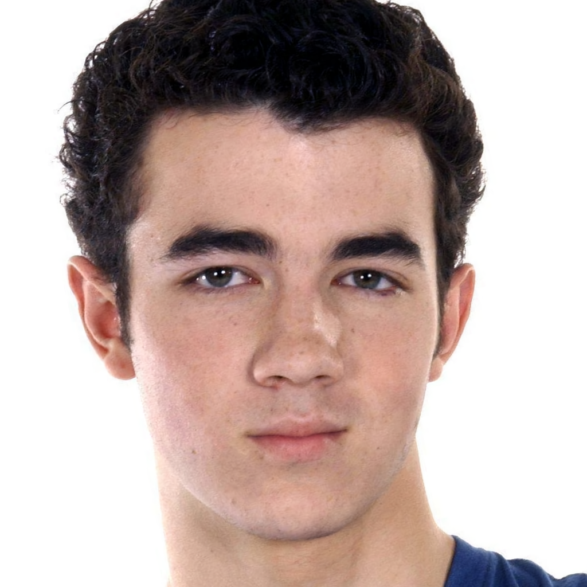

# Run LDM on CelebA-HQ

Please follow these instructions.

If you want more information, the original README file is at [here](./old_README.md).

## 0. Set up environment

```bash
conda env create -f environment.yaml
conda activate ldm
```

Set up vpn properly if you are in China.

## 1. Download data

See [this repo](https://github.com/Hope7Happiness/CelebA_HQ_Download) to download the `npy` files for CelebA-HQ.

```bash
ln -s /path/to/your/npys ./data/celebahq
ln -s $(pwd)/data/celebahqtrain.txt ./data/celebahq/
ln -s $(pwd)/data/celebahqvalidation.txt ./data/celebahq/
```

Sanity check: run

```bash
python sanity.py
```

You should expect an image like this in `./tmp/example.png`:



## 2. Download VQ-VAE

```bash
wget -O models/first_stage_models/vq-f4/model.zip https://ommer-lab.com/files/latent-diffusion/vq-f4.zip
cd models/first_stage_models/vq-f4
unzip -o model.zip
```

## 3. Modify some code

```bash
rm src/taming-transformers/taming/data/base.py
cp taiming_base.py src/taming-transformers/taming/data/base.py
```

## [Important] Sanity check FID

Please run [this](#download-pre-trained-model-and-eval-fid) and evaluate the FID of 50000 samples from the pretrained model. **Please use multiple CUDA devices and a larger batch size for faster sampling**.

**If the FID is larger than 5.61, please stop and report to me.**

## 4. Run the script

```bash
bash run.sh
```

Based on how much GPU you have, you should change the `CUDA_VISIBLE_DEVICES` and `--gpus` in the script.

An example log is at `reference.log`, note that this log use another set of configurations (e.g. `batch_size` is 1, etc.)

There will also be a log dir in `./logs`, and it will contain checkpoints (`checkpoints`), the samples from the model during training (`images/train`), and some tf files (`testtube/version_0/tf`). It seems that the `ldm` environment can't read the tfrecord file due to version incompatibility, but a reasonable environment should be able to read it.

## 5. Eval FID

### Prepare the dataset for FID

```bash
python prep_fid_eval.py
```

### Sampling from the trained model

Not implemented. We should first make sure the model can generate proper images.

# Backup Scripts

## Download Pre-trained model and eval FID:

### prepare the dataset for FID

```bash
python prep_fid_eval.py
```

### download the model

```bash
wget -O models/ldm/celeba256/celeba-256.zip https://ommer-lab.com/files/latent-diffusion/celeba.zip
cd models/ldm/celeba256
unzip -o celeba-256.zip
```

### sample images

Please **modify the number of samples** (denoted by `-n`) and **batch size** (denoted by `--batch_size`) before running the script.

```bash
bash sample_for_fid.sh
```

The output will include something like this

```
===========================================================================
logging to:
./eval_fid/celeba256/samples/00490000/2025-01-03-22-50-36
===========================================================================
```

Please take down the path!

### calculate FID:

Enter your path in the following command and run:

```bash
fidelity --gpu 0 --fid --input2 ./eval_fid/celeba256_ref --input1 ./eval_fid/celeba256/samples/remaining/path/2025-xxxxxx/img
```

(don't forget to add `img` at the end of the path of input 2)

This script is also copied in `eval_fid.sh` for conveninence.

2000 images from the model should give you a FID score around 12.1. 

**TODO**: what about 50000 images? we should reproduce this first before training the model.